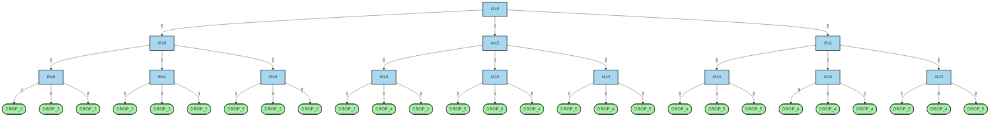

# Visualização da Árvore de Decisão

```mermaid
graph TD
    Node0["r2c3"]
    style Node0 fill:#a7d8f0,stroke:#333,stroke-width:2px
    Node0 -- "0" --> Node0_0
    Node0_0["r5c6"]
    style Node0_0 fill:#a7d8f0,stroke:#333,stroke-width:2px
    Node0_0 -- "0" --> Node0_0_0
    Node0_0_0["r5c5"]
    style Node0_0_0 fill:#a7d8f0,stroke:#333,stroke-width:2px
    Node0_0_0 -- "1" --> Node0_0_0_0
    Node0_0_0_0(["DROP_3"])
    style Node0_0_0_0 fill:#a7f0a7,stroke:#333,stroke-width:2px
    Node0_0_0 -- "0" --> Node0_0_0_1
    Node0_0_0_1(["DROP_3"])
    style Node0_0_0_1 fill:#a7f0a7,stroke:#333,stroke-width:2px
    Node0_0_0 -- "2" --> Node0_0_0_2
    Node0_0_0_2(["DROP_3"])
    style Node0_0_0_2 fill:#a7f0a7,stroke:#333,stroke-width:2px
    Node0_0 -- "1" --> Node0_0_1
    Node0_0_1["r5c1"]
    style Node0_0_1 fill:#a7d8f0,stroke:#333,stroke-width:2px
    Node0_0_1 -- "0" --> Node0_0_1_0
    Node0_0_1_0(["DROP_3"])
    style Node0_0_1_0 fill:#a7f0a7,stroke:#333,stroke-width:2px
    Node0_0_1 -- "2" --> Node0_0_1_1
    Node0_0_1_1(["DROP_3"])
    style Node0_0_1_1 fill:#a7f0a7,stroke:#333,stroke-width:2px
    Node0_0_1 -- "1" --> Node0_0_1_2
    Node0_0_1_2(["DROP_3"])
    style Node0_0_1_2 fill:#a7f0a7,stroke:#333,stroke-width:2px
    Node0_0 -- "2" --> Node0_0_2
    Node0_0_2["r3c4"]
    style Node0_0_2 fill:#a7d8f0,stroke:#333,stroke-width:2px
    Node0_0_2 -- "1" --> Node0_0_2_0
    Node0_0_2_0(["DROP_5"])
    style Node0_0_2_0 fill:#a7f0a7,stroke:#333,stroke-width:2px
    Node0_0_2 -- "0" --> Node0_0_2_1
    Node0_0_2_1(["DROP_3"])
    style Node0_0_2_1 fill:#a7f0a7,stroke:#333,stroke-width:2px
    Node0_0_2 -- "2" --> Node0_0_2_2
    Node0_0_2_2(["DROP_3"])
    style Node0_0_2_2 fill:#a7f0a7,stroke:#333,stroke-width:2px
    Node0 -- "1" --> Node0_1
    Node0_1["r4c5"]
    style Node0_1 fill:#a7d8f0,stroke:#333,stroke-width:2px
    Node0_1 -- "0" --> Node0_1_0
    Node0_1_0["r0c3"]
    style Node0_1_0 fill:#a7d8f0,stroke:#333,stroke-width:2px
    Node0_1_0 -- "1" --> Node0_1_0_0
    Node0_1_0_0(["DROP_2"])
    style Node0_1_0_0 fill:#a7f0a7,stroke:#333,stroke-width:2px
    Node0_1_0 -- "0" --> Node0_1_0_1
    Node0_1_0_1(["DROP_4"])
    style Node0_1_0_1 fill:#a7f0a7,stroke:#333,stroke-width:2px
    Node0_1_0 -- "2" --> Node0_1_0_2
    Node0_1_0_2(["DROP_2"])
    style Node0_1_0_2 fill:#a7f0a7,stroke:#333,stroke-width:2px
    Node0_1 -- "1" --> Node0_1_1
    Node0_1_1["r2c4"]
    style Node0_1_1 fill:#a7d8f0,stroke:#333,stroke-width:2px
    Node0_1_1 -- "2" --> Node0_1_1_0
    Node0_1_1_0(["DROP_5"])
    style Node0_1_1_0 fill:#a7f0a7,stroke:#333,stroke-width:2px
    Node0_1_1 -- "1" --> Node0_1_1_1
    Node0_1_1_1(["DROP_6"])
    style Node0_1_1_1 fill:#a7f0a7,stroke:#333,stroke-width:2px
    Node0_1_1 -- "0" --> Node0_1_1_2
    Node0_1_1_2(["DROP_4"])
    style Node0_1_1_2 fill:#a7f0a7,stroke:#333,stroke-width:2px
    Node0_1 -- "2" --> Node0_1_2
    Node0_1_2["r2c4"]
    style Node0_1_2 fill:#a7d8f0,stroke:#333,stroke-width:2px
    Node0_1_2 -- "1" --> Node0_1_2_0
    Node0_1_2_0(["DROP_5"])
    style Node0_1_2_0 fill:#a7f0a7,stroke:#333,stroke-width:2px
    Node0_1_2 -- "0" --> Node0_1_2_1
    Node0_1_2_1(["DROP_4"])
    style Node0_1_2_1 fill:#a7f0a7,stroke:#333,stroke-width:2px
    Node0_1_2 -- "2" --> Node0_1_2_2
    Node0_1_2_2(["DROP_5"])
    style Node0_1_2_2 fill:#a7f0a7,stroke:#333,stroke-width:2px
    Node0 -- "2" --> Node0_2
    Node0_2["r5c1"]
    style Node0_2 fill:#a7d8f0,stroke:#333,stroke-width:2px
    Node0_2 -- "0" --> Node0_2_0
    Node0_2_0["r2c4"]
    style Node0_2_0 fill:#a7d8f0,stroke:#333,stroke-width:2px
    Node0_2_0 -- "0" --> Node0_2_0_0
    Node0_2_0_0(["DROP_4"])
    style Node0_2_0_0 fill:#a7f0a7,stroke:#333,stroke-width:2px
    Node0_2_0 -- "1" --> Node0_2_0_1
    Node0_2_0_1(["DROP_5"])
    style Node0_2_0_1 fill:#a7f0a7,stroke:#333,stroke-width:2px
    Node0_2_0 -- "2" --> Node0_2_0_2
    Node0_2_0_2(["DROP_5"])
    style Node0_2_0_2 fill:#a7f0a7,stroke:#333,stroke-width:2px
    Node0_2 -- "1" --> Node0_2_1
    Node0_2_1["r2c5"]
    style Node0_2_1 fill:#a7d8f0,stroke:#333,stroke-width:2px
    Node0_2_1 -- "0" --> Node0_2_1_0
    Node0_2_1_0(["DROP_4"])
    style Node0_2_1_0 fill:#a7f0a7,stroke:#333,stroke-width:2px
    Node0_2_1 -- "2" --> Node0_2_1_1
    Node0_2_1_1(["DROP_4"])
    style Node0_2_1_1 fill:#a7f0a7,stroke:#333,stroke-width:2px
    Node0_2_1 -- "1" --> Node0_2_1_2
    Node0_2_1_2(["DROP_4"])
    style Node0_2_1_2 fill:#a7f0a7,stroke:#333,stroke-width:2px
    Node0_2 -- "2" --> Node0_2_2
    Node0_2_2["r2c4"]
    style Node0_2_2 fill:#a7d8f0,stroke:#333,stroke-width:2px
    Node0_2_2 -- "1" --> Node0_2_2_0
    Node0_2_2_0(["DROP_2"])
    style Node0_2_2_0 fill:#a7f0a7,stroke:#333,stroke-width:2px
    Node0_2_2 -- "0" --> Node0_2_2_1
    Node0_2_2_1(["DROP_4"])
    style Node0_2_2_1 fill:#a7f0a7,stroke:#333,stroke-width:2px
    Node0_2_2 -- "2" --> Node0_2_2_2
    Node0_2_2_2(["DROP_5"])
    style Node0_2_2_2 fill:#a7f0a7,stroke:#333,stroke-width:2px
```